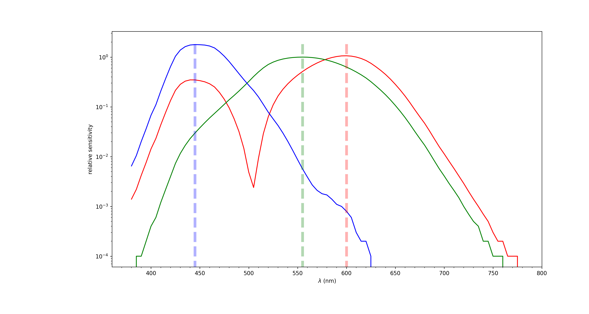
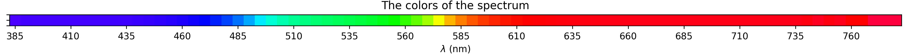

 

# lambda2color: convert a given light wavelength into the corresponding RGB color

This is a simple library to transform a given light wavelength into the corresponding RGB color.

It is based on the different sensitivities to a novel color space called the [CIE 193 " XYZ" color space](https://en.wikipedia.org/wiki/CIE_1931_color_space) and defined by the CIE colour matching function for 380 - 780 nm in 5 nm intervals :

This allows to simply compute for instance the color of different monochromatic lights:

