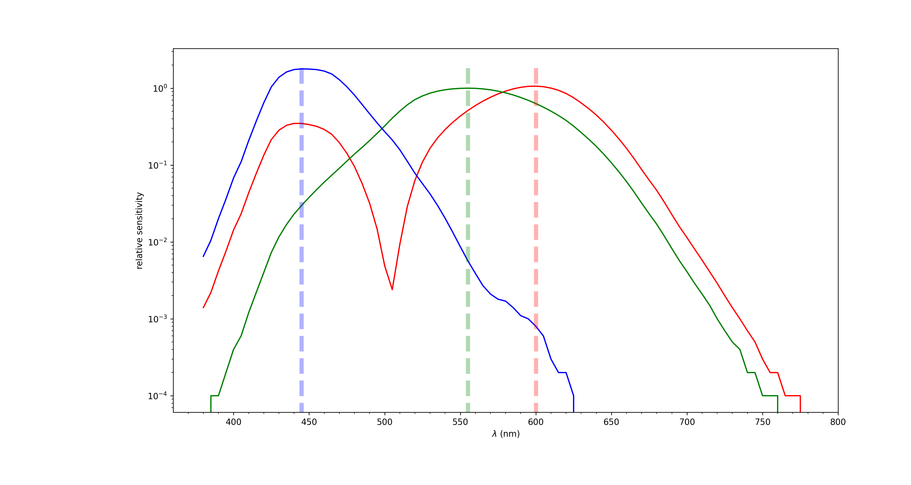
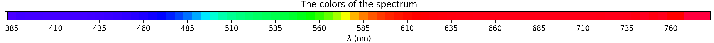

[](https://mybinder.org/v2/gh/laurentperrinet/lambda2color/main)
[](https://badge.fury.io/py/lambda2color)

# lambda2color: Wavelength-to-RGB Conversion

A lightweight Python library to convert light wavelengths (in nanometers) into corresponding RGB colors using the CIE 1931 XYZ color space.

## Features
- Convert wavelengths (380–780 nm) to RGB values.
- Based on the CIE 1931 color matching functions.
- Supports custom illuminants and color spaces.

## Installation
```bash
pip install lambda2color
```

## Usage
```python
from lambda2color import Lambda2color, xyz_from_xy

# Define a standard white illuminant (D65)
illuminant_D65 = xyz_from_xy(0.3127, 0.3291)

# Initialize color space conversion for sRGB
cs_srgb = Lambda2color(
    red=xyz_from_xy(0.64, 0.33),
    green=xyz_from_xy(0.30, 0.60),
    blue=xyz_from_xy(0.15, 0.06),
    white=illuminant_D65
)

# Convert wavelengths to RGB
for spec, color in [(445, 'blue'), (555, 'green'), (600, 'red')]:
    print(f'RGB for {color} ({spec} nm) is {cs_srgb.spec_to_rgb(spec)}')
```

## Documentation
- [Full documentation](./README.ipynb)
- [CIE 1931 XYZ color space](https://en.wikipedia.org/wiki/CIE_1931_color_space)

## Visualizations
### CIE Color Matching Functions


### Spectral Colors


## Advanced Use Cases
- [Computing the color of the sky](https://laurentperrinet.github.io/sciblog/posts/2020-07-04-colors-of-the-sky.html)
